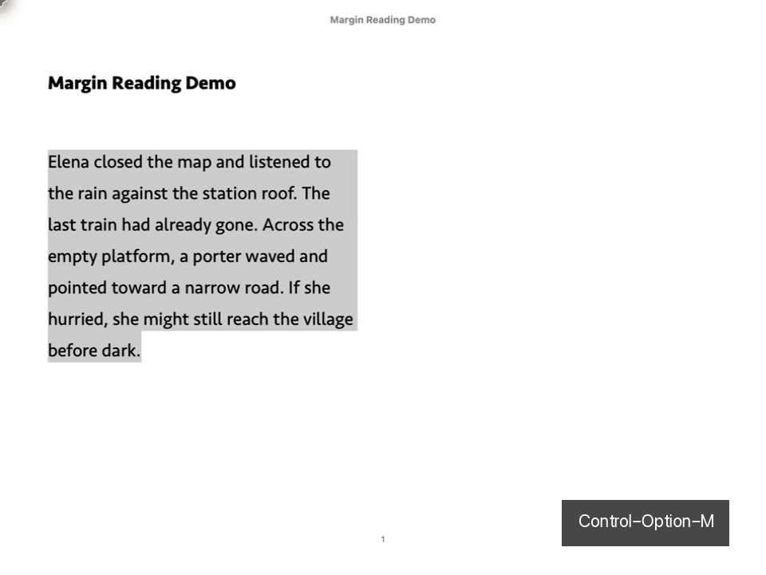

# Margin — Contextual reading for Apple Books on Mac

> **Read English. Stay in the book.**

[](https://github.com/UniqJade/Margin/actions/workflows/ci.yml)
[](https://github.com/UniqJade/Margin/releases)
[](LICENSE)


[简体中文](README.zh-CN.md)

Margin turns a hard English sentence into natural Simplified Chinese **without
pulling you out of Apple Books**. Select a word or a short passage, press one
shortcut, and the translation opens in a small panel beside the page. Dismiss it,
and you are back in the book — no app-switching, no lost place.

It does one thing and tries to do it well. Margin is not a dictionary, an OCR
tool, or a document translator. It just makes the small interruption of looking
something up while reading almost disappear.

## See it



*The passage is self-authored demonstration text; the Apple Books selection and
Margin's panel are captured from the real apps.*

## How you use it

1. In Apple Books, **select** a word — or a sentence or two.
2. Press **⌃⌥M** (Control–Option–M).
3. Read the result in the panel beside the page. Press again on anything else, or
   dismiss it to keep reading.

**Passages** open as a **Natural Translation** — the complete Chinese first, with
the English original tucked into a fold you open only when you want it. When a
passage splits into two or more aligned sentences, switch to **Bilingual View**
for numbered English–Chinese blocks. Both views are the *same* translation, so
the wording never contradicts itself.

**Words** come back as a compact card: pronunciation, senses grouped by part of
speech, and a couple of bilingual examples — enough to keep reading, not a whole
dictionary.

The panel stays out of the way: a small window that follows Light / Dark /
System, with Copy, Speak, Save, and Retry always one click away.

## Why it's good at this

- **Written for prose, not word-by-word.** The translation prompt aims for
  natural, published-quality Chinese, tuned for the two-to-four-sentence
  selections you actually hit in novels, biography, and nonfiction.
- **A note only when it matters.** A short nuance note appears only when ambiguity
  would change the meaning, tone, or who is being referred to — not on every
  lookup.
- **It sends only what you selected.** Never the book title, author, page, or the
  text around your selection.

Apple Look Up, Youdao, and Eudic have deeper dictionaries, OCR, and offline data.
Margin's one edge is a quieter Apple Books flow with prose-focused Chinese. Its
AI-generated content is not an authoritative dictionary — it can be wrong.

## How good is the translation?

Margin ships a local, offline blind A/B evaluator. The locked v0.1.0 run compared
DeepSeek against Apple's translation on 40 passages, with the book and category
mix fixed *before* any translation was collected:

| Measure | Result | Gate |
|---|---:|---:|
| Preferred for naturalness | **37 / 40** | ≥ 24 |
| As accurate as Apple or better | **37 / 40** | ≥ 36 |
| Major semantic errors | **0** | ≤ 1 |

A single-evaluator, author-run test — honest for these 40 passages, not a claim
that Margin beats Apple for every book or reader. Method and limits:
[docs/evaluation.md](docs/evaluation.md).

## Your data stays yours

Margin is data-minimizing by design. A request carries only your selected text
and its language — never the book, author, or page. Your API key lives in a
device-only Keychain item; results sit in a small local cache you can clear at any
time; nothing enters **Saved** unless you press Save. Selected text still goes to
the provider you configure, so Margin is private-by-design, not offline. See
[SECURITY.md](SECURITY.md).

## Run it on your Mac

Margin is **source-only, bring-your-own-key**: you build and sign your own copy in
Xcode and use your own DeepSeek API key — there is no download. Once set up, one
command installs it:

```
./scripts/install-mac.sh
```

Full prerequisites, signing, and first-run setup are in
**[Building Margin](docs/building.md)**. Verified on macOS 26.5 with Apple Books
8.5; the first time you press ⌃⌥M, allow Margin under **Privacy & Security →
Accessibility**, then press again.

## Scope

macOS only, English → Simplified Chinese only, cloud provider required. A personal
source build — no public binary, account sync, OCR, or document translation. AI
output can mistranslate or miss nuance, and word entries do not cite a licensed
dictionary.

## License

[MIT](LICENSE). Evaluation corpora keep their own provenance and licensing notes.
