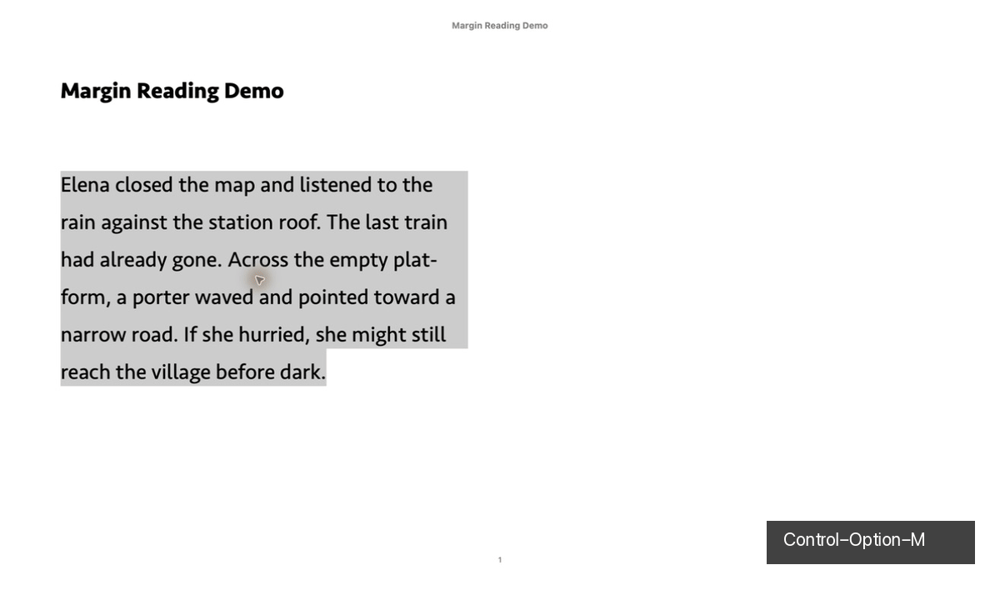

# Margin｜Apple Books 英文阅读助手

> **读懂英文，不离开书页。｜Read English. Stay in the book.**

[](https://github.com/UniqJade/Margin/actions/workflows/ci.yml)
[](https://github.com/UniqJade/Margin/releases)
[](LICENSE)


[English](README.en.md)

Margin 能在**不离开 Apple Books 的情况下**，把一句读不懂的英文译成自然的简体中文。
选中一个词或一小段，按一次快捷键，译文就在书页旁的浮层中打开；关闭浮层即可继续阅读——无需切换应用，也不会丢失阅读位置。

Margin 只做一件事：尽量消除“读英文时临时查一下”造成的打断。它不是完整词典，也不做 OCR 或文档翻译。

## 效果演示



*演示文本为原创；Apple Books 选区与 Margin 浮层均截取自真实应用。*

## 快速上手

1. 在 Apple Books 里**选中**一个词，或一两句话。
2. 按 **⌃⌥M**（Control–Option–M）。
3. 在书页旁的浮层中查看结果。选中其他内容后可再次按下快捷键，也可以关闭浮层继续阅读。

**段落**默认以**自然译文**打开——先显示完整中文，英文原文默认折叠，需要时再展开。当段落可拆为两句及以上时，可切换到**双语对照**，按编号阅读英—中对照内容。两种视图共用*同一份*译文，措辞不会互相矛盾。

**单词**会返回一张紧凑卡片：发音、按词性归类的释义，以及少量双语例句。信息足够支撑继续阅读，但不试图取代完整词典。

浮层以小窗口呈现，支持浅色、深色和跟随系统三种外观；复制、朗读、收藏和重试均可一键完成。

## 为英文阅读而设计

- **为书面语设计，而非逐词直译。** 翻译提示词追求自然、可出版质量的中文，专门针对
  你在小说、传记、非虚构里真正会遇到的 2–4 句选区。
- **只在需要时加一句说明。** 只有当歧义会改变含义、语气或指代对象时，才附一句简短
  提示——不是每次都给。
- **只发送你选中的文字。** 绝不发送书名、作者、页码或选区周围的内容。

Apple 的“查询”功能、有道和欧路拥有更丰富的词库，也支持 OCR 和离线数据。Margin 的
优势在于提供更少打扰的 Apple Books 阅读流程，并更专注于自然的书面中文。AI 生成的
内容并非权威词典释义，仍可能出错。

## 翻译质量与评测

Margin 内置一个本地、离线的 A/B 盲测工具。锁定的 v0.1.0 评测在**采集任何译文之前**
就固定了 40 段文本的书目与类别，再对比 DeepSeek 与 Apple：

| 指标 | 结果 | 门槛 |
|---|---:|---:|
| 自然度更受偏好 | **37 / 40** | ≥ 24 |
| 准确度不低于 Apple | **37 / 40** | ≥ 36 |
| 重大语义错误 | **0** | ≤ 1 |

这是一项由作者本人作为唯一评测者完成的测试。结果仅适用于这 40 段文本，不代表
Margin 对每本书、每位读者都优于 Apple。方法与局限见
[docs/evaluation.md](docs/evaluation.md)。

## 隐私与数据

Margin 按照数据最小化原则设计：请求只包含你选中的文字及其语言信息——绝不包含书名、作者或页码。API Key 保存在仅限本机的钥匙串项目中；结果进入可随时清除的小型本地缓存；只有主动点击收藏，内容才会进入**已收藏**。选中文字仍会发送给你配置的服务商，因此 Margin 注重隐私，但并非离线工具。详见 [SECURITY.md](SECURITY.md)。

## 安装与首次运行

Margin **仅以源码形式发布，并采用自备 API Key 的方式**：你需要在 Xcode 中自行构建和签名，并使用自己的 DeepSeek API Key；项目不提供预编译安装包。配置完成后，一条命令即可安装：

```
./scripts/install-mac.sh
```

完整环境要求、签名与首次设置见 **[构建 Margin](docs/building.md)**。已在 macOS 26.5 + Apple Books 8.5 验证；首次按 ⌃⌥M 时，在**隐私与安全性 → 辅助功能**里允许 Margin，然后再次按下快捷键。

## 支持范围与限制

目前仅支持 macOS、英语 → 简体中文，并依赖云端服务商。仅支持个人从源码构建，不提供公开二进制包、账户同步、OCR 或文档翻译。AI 输出可能误译或忽略细微语气；单词释义未引用经授权的权威词典内容。

## 开源许可

[MIT](LICENSE)。评测语料保留各自的来源与许可说明。
