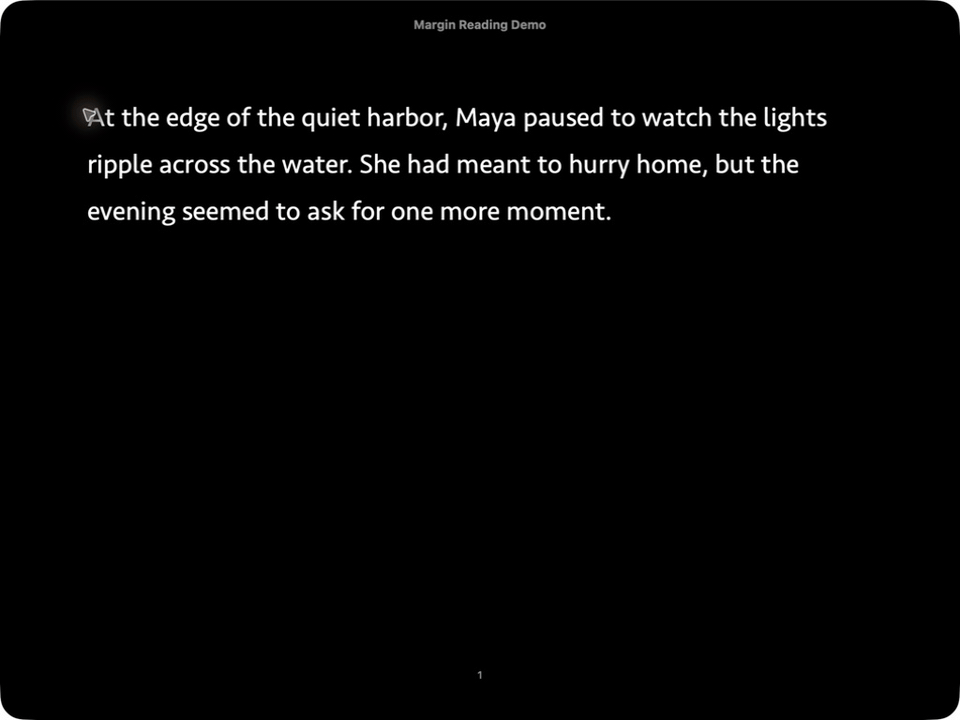

# Margin｜Apple Books 语境阅读助手

> **Read English. Stay in the book.｜阅读英文，不离开书页。**

[English](README.md)

Margin 是一个个人优先、开放源码的英语 → 简体中文阅读助手。在 Apple
Books 中选择单词或短文，按一次快捷键，就能在书页旁查看结果，而不必切换到
通用翻译软件。

Margin 刻意保持狭窄边界。它不试图取代综合词典、OCR 工具、文档翻译器或语言
学习平台；它只想让英文阅读中的一次中断变得更轻。

## 看看 Margin 如何工作

段落为自写演示文本。Apple Books 选区和 Margin 结果均截取自真实应用；
快捷键卡片是后期提示。

## 当前状态

| 平台 | 当前状态 | Apple Books 使用路径 |
|---|---|---|
| macOS | **已验证** | 选择文字，然后按 `Control–Option–M`（`⌃⌥M`） |
| iPhone / iPad | **实验性** | 已有 Action Extension 和快捷指令备用方案，但仍需真机验证 Books 是否传递选区 |

Mac 已验证环境是 macOS 26.5 和 Apple Books 8.5。该版本 Books 的阅读视图没有
开放直接的 macOS“服务”传递；已支持的路径是明确按下快捷键，并使用用户批准的
辅助功能权限。准确边界见[兼容性记录](docs/compatibility-spike.md)。

本仓库**只发布源码**，不提供公开 `.app`、DMG、TestFlight、托管服务或普通用户
安装支持。凭据方案是个人 BYOK：你自行构建 Margin，并使用自己的服务商 API
Key。

## Margin 的差异

- **留在书页上。** 一次快捷键只打开一个可复用浮层；关闭后立即回到阅读。
- **为书面文本设计。** 段落翻译以自然、可出版的中文为目标，重点覆盖小说、
  传记、历史和非虚构作品中常见的 2–4 句选区。
- **同一译文，两种视图。** “自然译文”显示完整中文；“语义对照”把同一份
  译文按原句对应关系重新组织，不会生成相互矛盾的第二份译文。
- **只解释重要语气。** 只有歧义可能改变含义、语气、指代或人物关系时，才要求
  模型给出简短说明。
- **紧凑的词典式单词结果。** 显示发音、可跳转词性、有限释义和双语例句，但
  不把阅读浮层变成完整词典应用。
- **可审查、个人优先。** 源码、请求边界、存储方式和提供商配置都可以检查和
  修改。

Margin 是 Apple“查询”、有道、欧路等工具的补充，而不是替代品。它们在系统
集成、成熟词库、OCR、离线词典、文档处理和学习功能方面明显更强。Margin 的
优势是更安静的 Apple Books 阅读流程，以及专门针对自然中文书面表达的翻译
提示；它由 AI 生成的词典内容不是权威词典来源。

## 阅读体验

### 段落查询

段落结果默认进入“自然译文”。结构化对齐可用时，可以切换到“语义对照”，
查看一个或多个相邻英文句子对应哪段中文。完整译文直接由这些有序中文片段拼接
而成，因此两种视图使用完全相同的中文措辞。只有结果包含至少两个对齐块时才会
显示模式切换；单一对齐块继续直接显示“自然译文”，避免两个近乎相同的界面。

长原文会自动折叠。短结果保持紧凑；长结果在 Mac 的 280–620 pt 浮层内滚动，
复制、朗读、收藏和重试始终可用，并继续使用原生 Apple 图标。

### 单词查询

单词结果根据模型返回顺序按词性组织常见释义，并显示可用的地区发音和双语例句。
词性导航可以点击，也支持键盘操作。v0.1.0 会冻结这一范围：短语模式、内置词典
和背词系统不属于本版本。

### 外观与语言

Margin 支持“跟随系统”“浅色”和“深色”，并使用克制的暖橙色强调色。界面
支持英语与简体中文，默认跟随设备语言；翻译方向仍然固定为英语 → 简体中文。

## 提供商策略

`deepseek-v4-flash` 是 Margin v0.1.0 唯一纳入认证范围的提供商/模型，也是提示词、
结构化结果和质量评测路径支持的配置，因此首次设置与设置页都将 DeepSeek 作为
主要选择。它已经通过下文所述的 v0.1.0 锁定盲测门槛。这里的“认证”仍只表示
一个边界明确的受支持配置，不代表在所有书籍、读者、模型或语言上普遍更优。

“高级”区域仍保留可配置的 OpenAI-compatible 地址与模型 ID，便于未来实验。
自定义提供商属于**未经验证、尽力兼容**：Margin 不承诺相同的 JSON 行为或
翻译质量。它不会静默切换提供商，也不会把同一选区同时发送给多个提供商。

## 隐私与本地数据

- 请求只包含你明确选择的文字、固定语言标识、查询类型和翻译风格。
- Margin 不收集书名、作者、页码或周围书页文字。
- Mac 上只有你按下 `⌃⌥M` 后才会模拟一次复制，并且仅当这次复制改变剪贴板时
  才接受选区；无关剪贴板内容不会被保留。
- API Key 以不同步、仅限本设备的方式保存在钥匙串中；每次启动首次读取后只缓
  存在进程内存中。
- 成功结果使用约 **10 MB** 上限的本地 LRU 响应缓存。缓存只是重复查询的加速
  数据，不是浏览历史，并且可以清除。
- 只有主动点击收藏后，查询才会出现在“已收藏”；取消收藏会从可见收藏中移除，
  未收藏查询不会自动积累成历史。
- 服务商原始响应不会被记录，也不会作为原始错误直接展示。

选择文字仍会发送给你配置的服务商。Margin 是“数据最小化”，并不是离线工具。
客户端直接 BYOK 只适合本地构建的个人原型；公共二进制版本必须改用带身份验证的
后端中转。详见 [SECURITY.md](SECURITY.md)。

## Mac 快速开始

1. 安装 Xcode、XcodeGen，以及带私钥的有效 Apple Development 证书。
2. 根据仓库示例创建被 Git 忽略的 `Local.xcconfig`。
3. 运行 `./scripts/install-mac.sh`，在 `~/Applications/Margin.app` 安装固定签名
   版本。
4. 在首次设置中填写自己的 DeepSeek API Key；Margin 会用无敏感内容的 `book`
   测试连接。
5. 在 Apple Books 中选择文字并按 `⌃⌥M`。首次使用时，在**隐私与安全性 →
   辅助功能**中允许这个固定安装的 Margin，回到 Books 后再按一次快捷键。

从 Spotlight 或程序坞打开 Margin 不会读取选区，也不会请求辅助功能权限。只有
主动按下选区捕获快捷键时，权限流程才会开始。

完整环境要求、无签名测试命令、签名配置、固定 Mac 安装、iOS 构建与缓存清理见
[构建 Margin](docs/building.md)。

## iPhone 与 iPad

仓库包含 iOS/iPadOS 容器 App、Action Extension 和 `Look Up English Text`
App Intent。它们已属于工程结构和模拟器构建范围，但尚未在真实 iPhone/iPad 上
验证 Apple Books 是否会把选中文字交给扩展。

在 [compatibility-spike.md](docs/compatibility-spike.md) 记录真机结果前，不应把
移动端 Apple Books 集成描述为已可用。如果 Books 打开扩展却没有文字，预定备用
路径是把 Share Sheet 的 Shortcut Input 传给 App Intent，并将该快捷指令固定在
分享菜单中。OCR 与截图识别不在范围内。

## 翻译评测

`Evaluation/` 中提供本地、完全不联网的 A/B 盲测工具。v0.1.0 正式评测在采集
候选译文前锁定了 40 段文本的书目与类别构成：传记/历史、小说/对话、一般
非虚构，以及习语/歧义/复杂句法各 10 段。其中 12 段来自作者本人的
Apple Books 私人书库，28 段来自有明确来源记录的公版作品。为适配 Apple
Books 选区长度限制而做的纯原文缩短修订记录在
[Evaluation/README.md](Evaluation/README.md)；修订时没有查看候选译文表现。

预先确定的 v0.1.0 通过门槛：

- DeepSeek 的自然度偏好率至少 60%；
- DeepSeek 准确性与 Apple 相当或更好的比例至少 90%；
- DeepSeek 严重语义错误最多 1 段。

本次评测于 2026 年 7 月 17 日完成，Apple 基线环境为 macOS 26.5 与
Apple Books 8.5：

| 指标 | 结果 | 门槛 |
|---|---:|---:|
| DeepSeek 自然度胜出 | **37/40（92.5%）** | ≥ 24/40 |
| DeepSeek 准确度与 Apple 相同或更好 | **37/40（92.5%）** | ≥ 36/40 |
| DeepSeek 阅读偏好胜出 | **37/40（92.5%）** | 描述性指标 |
| DeepSeek 重大语义错误 | **0** | ≤ 1 |

三项发布门槛均已通过。习语/歧义/复杂句法与一般非虚构表现最好，三个比较指标
均为 10/10。传记/历史是相对弱项：自然度胜出 7/10、准确度相同或更好 8/10、
阅读偏好胜出 7/10。

为了保持盲法，双方候选译文都通过同一套 `blind-display-v1` 简体中文排版契约
显示，服务商原始输出直到最终揭晓后才可见。独立的原始输出审计发现：Apple 有
4 段需要简繁转换、1 段需要统一引号字形、24 段需要根据原文调整整段外层引号；
DeepSeek 有 1 段需要调整空白。这些格式统计不参与内容质量门槛。

这是一次**由项目作者独自完成的单评测者盲测**，不是普遍用户研究。可辩护的
结论仅限于这组预先锁定的 40 段文本，不能据此宣称 Margin 对每本书、每位读者
都必然优于 Apple。完整方法、版权边界和局限见
[docs/evaluation.md](docs/evaluation.md)。

## 开发结构

仓库包括：

- `Apps/`：原生 macOS、iOS/iPadOS 与 Action Extension 外壳；
- `Sources/`：共享查询、校验、服务商、缓存和收藏逻辑；
- `Tests/`：确定性的 Swift 测试与 Mac hosted tests；
- `Evaluation/`：本地静态盲测工具。

常规测试不会调用真实 API。请先阅读 [docs/building.md](docs/building.md)，再查看
[CONTRIBUTING.md](CONTRIBUTING.md)。

## 已知不足

- 只支持英语 → 简体中文。
- 依赖云端服务商和网络；没有本地模型或离线词典。
- AI 可能误译、遗漏语气、编造词典细节或返回不合规结构。
- “语义对照”目前按句子对齐；一个很长但语法上仍属于单句的选区可能只生成一个
  对齐块，因此看起来与“自然译文”相近。
- 单词结果不引用获得许可的权威词典。
- Mac 已验证的 Apple Books 快捷键需要辅助功能权限。
- iPhone/iPad Apple Books 传递仍是实验性，尚未完成真机验证。
- 仅提供个人源码构建；没有公共二进制、账户同步、OCR、文档翻译或支持承诺。

## 许可证

Margin 源码采用 [MIT License](LICENSE)。评测语料仍遵循各自的来源与许可说明。
